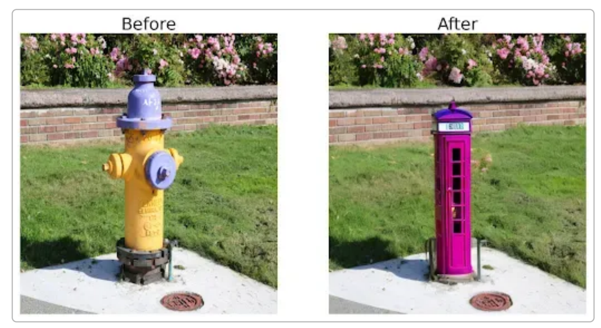

# 基于深度学习的多人合影重构技术研究

本项目旨在调研和梳理基于深度学习的多人合影重构技术相关的学术论文和资源。随着深度学习技术在图像生成、编辑和理解领域的飞速发展，多人合影的智能生成与编辑成为了一个备受关注的研究方向。这些技术不仅在社交娱乐、虚拟现实、影视制作等方面具有广泛的应用前景，也对人脸识别、姿态估计、场景理解等相关技术提出了新的挑战。

本仓库收集了近年来在该领域具有代表性的研究工作，涵盖了从虚拟人物合成、场景感知的人物插入、文本引导的图像编辑到特定主题的人物生成等多个方面。每篇论文都附有相应的链接，包括论文原文、开源代码（如果提供）以及项目主页（如果提供），方便研究者快速查阅和跟进最新的技术进展。

希望这个项目能够为自己和相关领域的研究人员提供一个有价值的参考资源。

## 目录

- [相关论文](#相关论文)
- [视觉大模型在多人合影重构中的应用](#视觉大模型在多人合影重构中的应用)

## 技术综述
    待总结

## 视觉大模型在多人合影重构中的应用

为实现合影插入中的目标检测与分割，视觉大模型的被逐渐引入。Meta 提出的 Segment Anything (SAM) 可通过点或框等提示对任意图像中的物体生成精确掩码，其零样本分割性能表现出色。Grounded SAM 将开集检测模型 Grounding DINO 与 SAM 结合，使得根据任意文本查询即可同时检测并分割指定区域。 同样，SEEM模型支持通过文本、图像等多模态提示“一次性”分割图像中所有对象并识别其类别。 这些模型可用于检测合影中的人物、座椅、沙发等目标并生成对应掩码，为插入操作提供空间定位和背景理解支持。

在人物身份和语义关系匹配方面，CLIP 及其变体等视觉语言模型也被广泛使用。比如AddMe框架中引入了并行运行的身份适配器(ID-Adapter)，并利用预训练的 CLIP 图像编码器提取参考人脸的身份特征，从而在扩散生成中保持高保真身份一致性。 AnyDoor工作注意到 CLIP 编码往往只能捕获粗略的语义信息，难以维持细节一致，因此采用了自监督模型 DINOv2 作为身份编码器主干，并通过去除背景和高频纹理映射等细节提取模块来补充图像细节。FastComposer 方法则将图像编码器抽取出的“subject embeddings”与文本条件一起输入扩散模型，以实现多人物生成。为了捕捉人物间的上下文关系，AddMe还设计了增强肖像注意力(EPA)模块，使生成模型理解不同角色之间的交互信息。另外，GLIGEN模型通过结合文本描述与空间框信息，对生成内容中的人物位置和样式进行精准控制，实现多模态条件下对人物布局的灵活指引。

如Roboflow技术所示，通过结合 Grounding DINO、SAM 和 Stable Diffusion 等模型，可以根据自然语言指令对图像内容进行编辑。例如在示例中，先通过 Grounding DINO 检测到“消防栓”并用 SAM 生成其掩码，然后调用 Stable Diffusion 模型基于文本“PhotoBooth”将其替换为一座警亭。类似思想可用于合影场景：先根据文本定位插入位置（如“沙发左侧”），再结合参考人像或文字描述，通过扩散模型完成新人物的生成和融合。目前已有一些研究探索了此类方案。DiffusionCLIP 等工作提出将 CLIP 与扩散模型结合，以零调方式实现文本驱动的图像操控；GLIGEN 则在冻结的 Stable Diffusion 模型中插入条件层，允许用户输入文本和边界框来控制生成内容 。AddMe 框架提供了端到端插入方案，它可以并行接受文本和空间条件，在目标区域快速生成具有指定参考人脸身份的新肖像 。更进一步，最新的 Person-In-Situ 方法引入了显式的 3D 人体姿态和场景深度控制，允许用户指定插入人物的姿势和深度位置，并利用扩散模型自然处理遮挡，使合成结果在视觉上更符合场景结构 。这些工作表明，将扩散模型与视觉语言技术结合，可实现基于自然语言的精准人像插入。

前已有若干系统尝试将视觉基础模型集成到合影编辑流水线中。以 GroupDiff 为例，其设计了完整的群体照片编辑流程：通过数据引擎合成训练样本，利用人体姿态骨架引导目标生成，并在扩散模型中将原始人物图像注入注意力模块，以保持编辑后人物外观的一致性；此外，GroupDiff 使用人物边界框对注意力矩阵加权，引导指定区域生成新人物，从而支持灵活的添加/删除操作。AddMe 和 AnyDoor 等方法也提供了插拔式解决方案，无需针对每个目标微调模型即可在指定位置插入新对象 。在工具层面，Diffusers 库和 HuggingFace 平台上集成了相关模型和管线。如 GLIGEN 的 Stable Diffusion 扩散管线已支持在给定输入图、文本描述和边界框的条件下插入目标对象。这些实践降低了使用视觉基础模型进行合影编辑的门槛，为多模态控制和高保真合成提供了参考范例。

上述内容均可在[相关论文](#相关论文)查阅对应资料。

## 相关论文

1. Hongming Lu: "Group Photo Realisation: A Survey of Multi person Group Photo Image Generation." IJERM (2023) [Paper](https://www.ijerm.com/download_data/IJERM2308001.pdf)

    - 这篇综述主要关注于多人合影图像生成技术。随着计算机视觉和人工智能的发展，尤其是在娱乐和社交媒体领域，对高质量、逼真的人物和群体图像的需求日益增长。该综述回顾了现有技术，包括使用传统计算机图形学方法、基于学习的方法，特别是深度学习如生成对抗网络和变分自编码器在合成、编辑和增强群体照片中的应用。同时，它还探讨了相关挑战，例如保持身份一致性、姿势多样性、光照协调以及不同个体间的合理交互，并展望了未来研究方向。

2. Oran Gafni, Lior Wolf: "Wish You Were Here: Context-Aware Human Generation." CVPR (2020) [Paper](https://openaccess.thecvf.com/content_CVPR_2020/papers/Gafni_Wish_You_Were_Here_Context-Aware_Human_Generation_CVPR_2020_paper.pdf) | [arXiv](https://arxiv.org/abs/2005.10663)

    - 该论文提出了一种新颖的方法，用于在给定单个参考图像的情况下，将人物插入到图像中。与现有方法不同，该方法能够生成具有特定姿势、外观和光照的人物，使其与目标场景的上下文相匹配。作者通过一个精心设计的生成对抗网络实现这一目标，该网络能够分离人物的外观和姿态，并将它们与目标场景的上下文信息相结合。实验结果表明，该方法能够生成高质量、逼真且与场景上下文一致的人物图像，在人物插入和虚拟试穿等应用中具有巨大潜力。

3. Prasun Roy, Subhankar Ghosh, Saumik Bhattacharya, Umapada Pal, Michael Blumenstein: "Scene Aware Person Image Generation through Global Contextual Conditioning." arXiv preprint arXiv:2206.02717 (2022) [arXiv](https://arxiv.org/abs/2206.02717)

    - 这篇论文提出了一种场景感知的人物图像生成方法，通过全局上下文条件来控制生成过程。与以往主要关注人物自身属性的方法不同，该工作强调了背景场景信息对于生成逼真且与环境融合的人物图像的重要性。作者设计了一个生成模型，该模型能够利用场景的全局上下文特征来指导人物的生成，从而确保生成的人物在姿态、光照和风格上与周围环境保持一致。实验证明，该方法能够有效地生成与各种复杂场景相协调的人物图像。

4. Shi, Zhenquan, Hongming Lu, Xinyue Sun, Jing Guo, Yongzhen Ke, Kai Wang, and Fan Qin. "Virtual group photography based on scene and person perception." Heliyon (2023) [Paper](https://www.sciencedirect.com/science/article/pii/S240584402306365X)
    - 这篇论文提出了一种虚拟群体摄影模型，旨在基于场景背景和个人特征自动合成群体照片，特别是通过整合缺失个体来提高群体照片的合成质量。该模型分为两个阶段：第一阶段是根据输入群体照片的上下文和目标个人的特征（如性别、年龄、身高和体重）预测要添加的个体的位置、姿势和边界；第二阶段则是利用第一阶段的结果生成新的群体照片。本研究的关键之处在于，所提出的方法能够在合成的图像中实现个体与现有个体之间自然的互动，同时保持其固有特征，从而显著提高合成图像的和谐性和真实性。论文还特别强调了在生成过程中考虑个体属性的多样性，以及将复杂问题拆分为两个相对简单的子任务，以改善合成效果。

5. Sumith Kulal, Tim Brooks, Alex Aiken, Jiajun Wu, Jimei Yang, Jingwan Lu, Alexei A. Efros, Krishna Kumar Singh: "Putting People in Their Place: Affordance-Aware Human Insertion into Scenes." CVPR (2023) [arXiv](https://arxiv.org/abs/2304.14406) | [Code](https://github.com/adobe-research/affordance-insertion) | [Project Page](https://sumith1896.github.io/affordance-insertion/)

    - 该论文提出了一种新颖的方法，用于将人物图像真实地插入到现有场景中，同时考虑到场景的物理约束和功能区域（affordances）。研究团队开发了一个系统，能够分析场景图像，理解其中不同区域的用途（如可以坐的椅子、可以站立的地面），然后根据指定的动作（如"坐下"、"站立"）将人物以合理的方式放置到场景中。该方法不仅考虑了几何对齐，还确保了人物姿态与场景功能区域的语义一致性，从而生成更加真实可信的合成图像。

6. Masuda, Shun, Yuki Endo, and Yoshihiro Kanamori. "Person-In-Situ: Scene-Consistent Human Image Insertion with Occlusion-Aware Pose Control." arXiv preprint arXiv:2505.04052 (2025). [arXiv](https://arxiv.org/abs/2505.04052) 
    - 该论文提出了一种能够控制曝光的人物图像生成方法。在许多图像编辑和合成任务中，控制生成图像的曝光至关重要，以确保其与目标场景的光照条件一致或达到特定的艺术效果。作者提出了一种新颖的深度学习框架，该框架允许用户精确控制生成人物图像的曝光水平，同时保持人物身份和图像其他方面（如姿态、服装）的真实性。实验结果表明，该方法能够有效地生成具有不同且可控曝光效果的高质量人物图像。

7. Zanfir, Mihai, Elisabeta Oneata, Alin-Ionut Popa, Andrei Zanfir, and Cristian Sminchisescu. "Human synthesis and scene compositing." In Proceedings of the AAAI Conference on Artificial Intelligence, vol. 34, no. 07, pp. 12749-12756. 2020. [Paper](https://ojs.aaai.org/index.php/AAAI/article/view/6969)
    - 这篇论文提出了一种名为HUSC（Human Synthesis and Scene Compositing）框架，旨在生成高质量、真实感的合成图像。该框架通过有效控制人的外观、姿势和如何将其融入不同场景中，实现逼真的合成效果。其核心在于3D推理，以确保在合成过程中处理真实的透视效果和遮挡管理。

8. Weng, Shuchen, Wenbo Li, Dawei Li, Hongxia Jin, and Boxin Shi. "Misc: Multi-condition injection and spatially-adaptive compositing for conditional person image synthesis." CVPR (2020) [Paper](https://openaccess.thecvf.com/content_CVPR_2020/papers/Weng_MISC_Multi-Condition_Injection_and_Spatially-Adaptive_Compositing_for_Conditional_Person_Image_CVPR_2020_paper.pdf) | [Code](https://github.com/shuchenweng/MISC) 
    - 这篇论文提出了一种名为MISC（多条件注入与空间自适应合成）的框架，旨在合成现实感强的人像图像，该框架在多种条件下进行有效的图像生成与合成。其方法主要分为两个阶段：第一阶段是条件图像生成，专注于根据几何、图案和颜色属性生成纹理；第二阶段是自适应合成，将生成的前景图像与各种背景进行对齐。

9. Yue, Dongxu, Maomao Li, Yunfei Liu, Qin Guo, Ailing Zeng, Tianyu Yang, and Yu Li. "AddMe: Zero-Shot Group-Photo Synthesis by Inserting People Into Scenes." In European Conference on Computer Vision, pp. 222-239. Cham: Springer Nature Switzerland, 2024. [Paper](https://link.springer.com/chapter/10.1007/978-3-031-72661-3_13) | [Code](http://addme-awesome.github.io/page/)
    - 这篇论文介绍了AddMe，一个基于扩散模型的框架，旨在实现零-shot群体照片合成，允许用户通过提供单个参考面孔和用户自定义的掩膜，将个性化的肖像插入到现有图像中。AddMe解决了当前定制化方法在群体照片中有效管理面部身份和互动性方面的局限性。该方法引入了一种新颖的身份适配器，能够将面部表示与场景中的现有角色解耦，并通过增强的肖像注意模块捕捉上下文信息，以实现真实的互动。

10. Wang, Yibin, Yuchao Feng, and Jianwei Zheng. "Learning Object Placement via Convolution Scoring Attention." BMVC, 2024. [Paper](https://bmva-archive.org.uk/bmvc/2024/papers/Paper_165/paper.pdf) | [Code](https://github.com/CodeGoat24/CSANet)
    - 这篇论文提出了一种新颖的网络结构CSANet，旨在改善对象放置问题，特别是在前景物体与背景场景之间的多尺度语义交互方面。CSANet包含两个主要组件，即基于金字塔池化的卷积评分联合注意力（PCSUA）和自注意力（PCSSA）。

11. Mueller, Phillip, Jannik Wiese, Ioan Craciun, and Lars Mikelsons. "InsertDiffusion: Identity Preserving Visualization of Objects through a Training-Free Diffusion Architecture." arXiv preprint arXiv:2407.10592 (2024). [arXiv](https://arxiv.org/abs/2407.10592) | [Paper](https://github.com/ragor114/InsertDiffusion)
    - 这篇论文介绍了InsertDiffusion，一种新颖的训练-free扩散架构，旨在高效地将物体嵌入图像中，同时保持其结构完整性和身份特征。InsertDiffusion利用现有的生成模型，实现快速可视化，特别适用于产品设计和市场营销等领域。与需要微调或修改物体特征的先前方法不同，InsertDiffusion使用现成的模型进行逼真的图像生成，表现出更佳的性能和更低的复杂性。该方法通过将任务分解为独立步骤，优化可视化过程，生成的高质量图像能够保持原始物体的真实性。论文还讨论了通过扩散模型在图像合成方面的进展，并强调了像Stable Diffusion和CLIP等模型在提高图像质量和真实感方面的作用。

12. Li, Zhen, Mingdeng Cao, Xintao Wang, Zhongang Qi, Ming-Ming Cheng, and Ying Shan. "Photomaker: Customizing realistic human photos via stacked id embedding." In Proceedings of the IEEE/CVF conference on computer vision and pattern recognition, pp. 8640-8650. 2024. [Paper](https://openaccess.thecvf.com/content/CVPR2024/papers/Li_PhotoMaker_Customizing_Realistic_Human_Photos_via_Stacked_ID_Embedding_CVPR_2024_paper.pdf) | [Code](https://photo-maker.github.io/) 
    - 这篇论文介绍了PhotoMaker，一种新颖的文本到图像生成方法，旨在通过堆叠ID嵌入技术从多个输入ID图像中创建现实感强的个性化人像照片。该方法有效地保留了身份信息，并允许基于文本的自定义，同时避免了传统个性化生成方法的繁琐手动数据收集和调优过程。PhotoMaker可以在约10秒内生成定制化图像，并显著提高了身份保真度和生成多样性，支持任何数量的ID输入，且通过确保多样的视角和表情，避免了无关信息的记忆。此外，该框架拓展了许多应用场景，包括属性修改、混合身份和从艺术作品中有效重构人物，展示了在个性化图像生成领域的重大进展。

<!-- 13. Zhen Li, Mingdeng Cao, Xintao Wang, Zhongang Qi, Ming-Ming Cheng, Ying Shan: "PhotoMaker: Customizing Realistic Human Photos via Stacked ID Embedding." arXiv preprint arXiv:2312.04461 (2023) [arXiv](https://arxiv.org/abs/2312.04461) | [Project Page](https://photo-maker.github.io/) | [Code](https://huggingface.co/papers/2312.04461) -->

14. Qingyang Liu, Junqi You, Jianting Wang, Xinhao Tao, Bo Zhang, Li Niu: "Shadow Generation for Composite Image Using Diffusion model." CVPR (2024) [arXiv](https://arxiv.org/abs/2403.15234) | [Code](https://github.com/bcmi/Object-Shadow-Generation-Dataset-DESOBAv2)
    - 这篇论文探讨了在合成图像中为前景物体生成逼真阴影的挑战，提出了一种方法，通过适应ControlNet模型和引入强度调制模块，解决了在光照和物体几何等因素影响下的阴影生成复杂性。作者扩展了现有的DESOBA数据集，构建了新的数据收集管道，从而创建DESOBAv2数据集，以提供更多的图像和配对供训练使用。该方法增强了阴影的强度和真实感，采用条件基础模型，并对U-Net架构进行了修改，以输出阴影掩膜。通过在DESOBA和新的DESOBAv2数据集上进行实验，结果显示该方法在阴影生成任务中显著优于现有的其他方法，证明了其有效性和优势。

15. Alexander Kirillov, Eric Mintun, Nikhila Ravi, Hanzi Mao, Chloe Rolland, Laura Gustafson, Tete Xiao, Spencer Whitehead, Alexander C. Berg, Wan-Yen Lo, Piotr Dollár, Ross Girshick: "Segment Anything." arXiv preprint arXiv:2304.02643 (2023) [arXiv](https://arxiv.org/abs/2304.02643) | [Code](https://github.com/facebookresearch/segment-anything) | [Project Page](https://segment-anything.com)
    - 这篇论文介绍了Segment Anything（SA）项目，旨在推进图像分割领域，提出了一种新的任务、模型和数据集。核心内容包括可提示的分割任务、Segment Anything Model（SAM）以及SA-1B数据集，后者包含超过10亿个基于1100万张受许可图像生成的分割掩膜。SAM在零-shot泛化方面表现卓越，无需微调即可在多种任务上取得竞争性能。该项目的创新之处在于其数据引擎，自动化数据收集，提升了模型训练的效率，分为三个阶段：协助手动、半自动和完全自动注释。SAM设计为处理多种提示，包括点、框和文本提示，同时能够合理地管理输出中的歧义，整体上旨在为计算机视觉研究提供前所未有的资源和能力。

16. Ren, Tianhe, Shilong Liu, Ailing Zeng, Jing Lin, Kunchang Li, He Cao, Jiayu Chen et al. "Grounded sam: Assembling open-world models for diverse visual tasks." arXiv preprint arXiv:2401.14159 (2024). [arXiv](https://arxiv.org/pdf/2401.14159) | [Code](https://github.com/IDEA-Research/Grounded-Segment-Anything) | [Project Page](https://dreambooth.github.io/)
    - 这篇论文介绍了GroundedSAM，一个旨在提升开放世界视觉任务（如检测和分割）的创新框架。该框架通过使用任意文本输入，实现了高效的开放集分割，并通过与Recognize Anything（RAM）和BLIP等模型的协作，支持自动图像注释。此外，集成Stable Diffusion模型使得图像编辑能够更加可控。研究表明，GroundedSAM在“Segmentation in the Wild”零-shot基准测试中表现出色，平均精度（AP）达到48.7，展示了其在开放世界场景中的卓越性能。该方法有效克服了现有技术的局限，通过集成多种模型能力，构建出一个灵活且强大的视觉处理平台，有助于应对复杂的视觉任务。

17. Chen, Xi, Lianghua Huang, Yu Liu, Yujun Shen, Deli Zhao, and Hengshuang Zhao. "Anydoor: Zero-shot object-level image customization." In Proceedings of the IEEE/CVF conference on computer vision and pattern recognition, pp. 6593-6602. 2024. [Paper](https://openaccess.thecvf.com/content/CVPR2024/papers/Chen_AnyDoor_Zero-shot_Object-level_Image_Customization_CVPR_2024_paper.pdf) | [Code](https://github.com/ali-vilab/AnyDoor)
    - 这篇论文介绍了AnyDoor，一种基于扩散模型的图像生成器，旨在实现零-shot图像定制，使用户能够在场景图像中无缝放置对象，而无需对每个对象进行参数调整。AnyDoor通过利用训练好的身份和细节特征，保持视觉一致性，系统使用ID令牌和细节图引导预训练的文本到图像扩散模型，生成高质量且保持身份一致的合成图像。该模型支持附加控制，例如用户绘制的遮罩，用于形状和姿势定制，并借助视频数据集中的多样图像对，提升了在不同场景下的适应性。大量实验表明，AnyDoor在多个现有方法中表现优越，非常适合虚拟试衣、形状编辑和对象交换等应用。

18. Guangxuan Xiao, Tianwei Yin, William T. Freeman, Frédo Durand, Song Han: "FastComposer: Tuning-Free Multi-Subject Image Generation with Localized Attention." arXiv preprint arXiv:2305.10431 (2023) [arXiv](https://arxiv.org/abs/2305.10431) | [Code](https://github.com/mit-han-lab/fastcomposer) | [Project Page](https://fastcomposer.mit.edu/)
    - 这篇论文介绍了FastComposer，一种高效的个性化多主体文本到图像生成方法，避免了现有模型中通常需要的昂贵微调。FastComposer利用从图像中提取的主体嵌入来增强文本条件，同时在训练过程中采用交叉注意力定位策略，以减少主体间身份混合的问题。此外，它引入了延迟主体条件化的方法，以保持个体身份并基于文本输入对主体进行编辑。此方法在速度上实现了显著的提升，速度比传统方法快300到2500倍，并节省内存，不需要为新主体额外存储，预示着更加便捷和多样化的图像生成可能性。

19. Yuheng Li, Haotian Liu, Qingyang Wu, Fangzhou Mu, Jianwei Yang, Jianfeng Gao, Chunyuan Li, Yong Jae Lee: "GLIGEN: Open-Set Grounded Text-to-Image Generation." CVPR (2023) [arXiv](https://arxiv.org/abs/2301.07093) | [Code](https://github.com/gligen/GLIGEN) | [Project Page](https://gligen.github.io/)
    - 这篇论文介绍了GLIGEN（Grounded-Language-to-Image Generation），一种新颖的文本到图像生成方法，通过结合各种基础输入（如边界框和关键点）增强了传统模型的功能。GLIGEN保持预训练模型的权重不变，通过一个门控机制引入新的学习层，以处理这些附加输入，从而实现可控的开放世界图像合成。实验证明，GLIGEN在布局到图像生成等任务上具有优越的零-shot性能，超越了现有的监督基线，展示了在接触不熟悉概念时良好的泛化能力。该模型的创新结构促进了采样的灵活性和质量，推动了基础文本到图像生成领域的发展。

20. Gwanghyun Kim, Taesung Kwon, Jong Chul Ye: "DiffusionCLIP: Text-Guided Diffusion Models for Robust Image Manipulation." CVPR (2022) [arXiv](https://arxiv.org/abs/2110.02711) | [Code](https://github.com/gwang-kim/DiffusionCLIP)
    - 这篇论文介绍了DiffusionCLIP，一种创新的文本引导图像操控方法，该方法利用扩散模型克服了传统GAN反演方法面临的局限性。DiffusionCLIP能够实现真实图像的忠实操控，并支持零-shot操控，即使在未见过的领域中也能成功处理。其关键创新在于多种微调模型的噪声组合，允许在同一过程同时改变多个属性。通过大量实验和人工评估，研究表明，DiffusionCLIP在性能和准确性方面超过了现有技术，展示了在不同未见领域之间进行图像转换和从草图生成图像的有效应用。作者公开了相应的代码以供进一步使用和验证。

21. Shun Masuda, Yuki Endo, Yoshihiro Kanamori: "Person-In-Situ: Scene-Consistent Human Image Insertion with Occlusion-Aware Pose Control." arXiv preprint arXiv:2505.04052 (2025) [arXiv](https://arxiv.org/abs/2505.04052) | [Code](https://github.com/YangChangHee/CVPR2024_Person-In-Place_RELEASE) | [Project Page](https://yangchanghee.github.io/Person-in-Place_page/)
    - 这篇论文提出了一种新的处理人像图像合成的方法，该方法同时考虑了遮挡处理和姿势控制，克服了现有方法在这些方面的不足。研究者提出了两种技术：第一种是两阶段的方法，首先学习场景的深度图，然后根据该深度图合成插入的人物；第二种是直接方法，无需明确的深度监督，直接从输入数据中合成人物。两种方法都利用潜在扩散模型，确保插入人物在适当的深度上下文中，从而实现更自然的场景融合。实验结果显示，这两种方法在维护场景一致性和准确反映遮挡及用户指定姿势方面表现优越，显著提升了合成图像的质量。

22. Yuming Jiang, Nanxuan Zhao, Qing Liu, Krishna Kumar Singh, Shuai Yang, Chen Change Loy, Ziwei Liu: "GroupDiff: Diffusion-based Group Portrait Editing." ECCV (2024) [arXiv](https://arxiv.org/abs/2409.14379) | [Code](https://github.com/yumingj/GroupDiff) | [Project Page](https://github.com/yumingj/GroupDiff)
    - 这篇论文介绍了GroupDiff，一种基于扩散模型的群体肖像编辑新方法，旨在解决在群组照片中添加、移除和操控人物所面临的挑战。该方法包括三个关键贡献：首先，设计了一个数据引擎以生成针对群体肖像编辑需求的标注训练数据；其次，提出了一种外观保持机制，通过注意力引导特征确保编辑后图像的一致性；最后，利用边界框实现控制灵活性，以便精确操控特征。GroupDiff有效地合成了编辑过程中的人际互动，同时保持了个体的身份，实验结果显示其在各类群体肖像编辑任务中表现优越，提供了对编辑过程的良好控制能力。